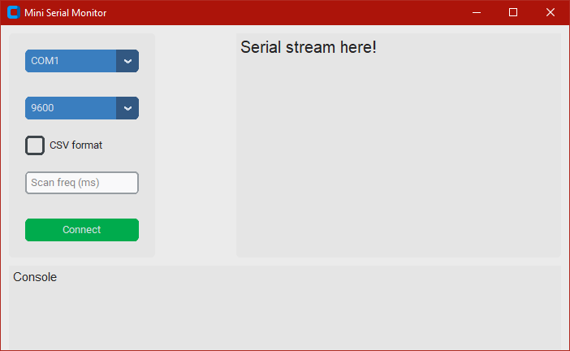

# The Mini Serial Monitor lets you see your serial stream one *just one line*, and not like a unclear stream of data (as Arduino)


# Setup:
1. Setup Python VENV, activate it and install requirements:
- Mac:
```
python -m venv venv
source venv/bin/activate
pip install -r requirements.txt  # Install all the libs.
```
- Windows:
```
python -m venv venv
venv/Scripts/activate
pip install -r requirements.txt  # Install all the libs.
```
2. Run script:
```
python main.py
```
# Implementation:
_Python_ with [_CustomTKinter_](https://github.com/TomSchimansky/CustomTkinter) and [_PySerial_](https://github.com/pyserial/pyserial), using [_pyinstaller_](https://pyinstaller.org/en/stable/) for distribution.

# Future implementation:
- CSV beautify reader
- Better serial sampling
- Better sctring handling
- Better distribution management